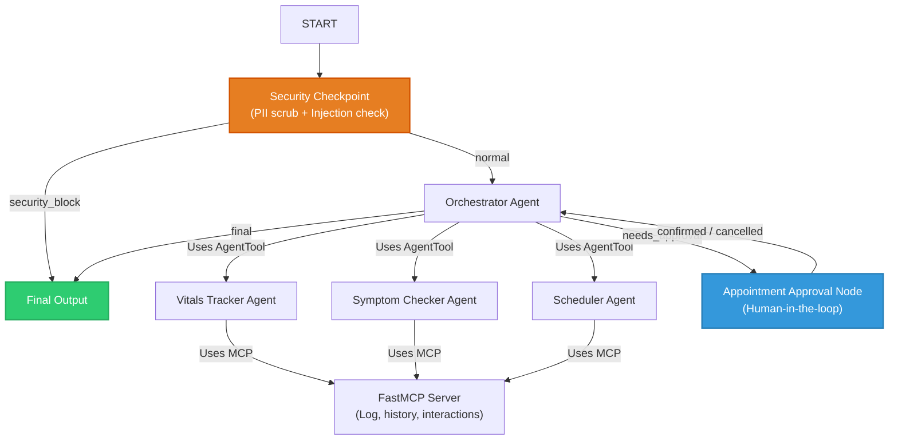

# healthsync

A secure personal health and wellness coordinator agent that tracks daily vitals, checks medical symptoms/drug interactions, and schedules/syncs doctor appointments.

## Prerequisites

Ensure you have:
*   **Python**: 3.11 or higher
*   **uv**: Fast Python package manager ([Astral uv](https://astral.sh/uv))
*   **Gemini API Key**: Create one at [Google AI Studio](https://aistudio.google.com/apikey)

## Quick Start

1.  Clone the repository:
    ```bash
    git clone <repo-url>
    cd healthsync
    ```
2.  Set up environment file:
    ```bash
    # Copy template to .env and add your GOOGLE_API_KEY
    copy .env.example .env
    ```
3.  Install dependencies:
    ```bash
    uv sync --link-mode=copy
    ```
4.  Launch the local playground:
    ```bash
    uv run adk web app --host 127.0.0.1 --port 18081 --reload_agents
    ```
    *(Opens the agent playground UI at http://localhost:18081)*

---

## Solution Architecture

The agent is built using the ADK 2.0 graph-based workflow. The flow starts with security validation, delegates user queries to specialized sub-agents via standard `AgentTool` instances, handles human-in-the-loop approvals for doctor appointments, and finally outputs the result.



---

## How to Run

*   **Interactive Playground UI**:
    ```bash
    uv run adk web app --host 127.0.0.1 --port 18081 --reload_agents
    ```
*   **FastAPI Local Web Server Mode**:
    ```bash
    uv run uvicorn app.fast_api_app:app --host 0.0.0.0 --port 8000
    ```

---

## Sample Test Cases

### Test Case 1: Vitals Tracking and History
*   **Input**: `"Can you log my blood sugar as 110 mg/dL?"` followed by `"Show me my blood sugar history."`
*   **Expected**: The Orchestrator delegates to the Vitals Tracker Agent, which uses `log_vital_sign` and then `get_vitals_history`.
*   **Check**: You will see a success log confirmation in the UI, and the history query will display a markdown list containing the blood sugar entry of `110 mg/dL`.

### Test Case 2: Medication Interaction Check
*   **Input**: `"I'm taking Aspirin and Ibuprofen. Are there any interactions?"`
*   **Expected**: The Orchestrator delegates to the Symptom Checker Agent, which runs `check_drug_interactions` on the drugs list.
*   **Check**: The agent outputs a warning: `Increased risk of gastrointestinal bleeding when taken together.` with a disclaimer to consult a doctor.

### Test Case 3: Human-in-the-loop Appointment Booking
*   **Input**: `"I need to schedule a checkup with Dr. Smith tomorrow at 10 AM."`
*   **Expected**: The Scheduler Agent writes the pending booking into `ctx.state` and routes to `appointment_approval`. The UI prompts with a confirmation form (RequestInput).
*   **Check**: The user sees the prompt: `Please confirm: Do you want to schedule this appointment?`. Replying `yes` resumes the workflow, books the appointment via the tool, and states success.

---

## Troubleshooting

1.  **"no agents found" / "extra arguments"**:
    Ensure you specify the target agent directory name exactly. On Windows, run: `uv run adk web app ...` (instead of standard wildcard expansion `*`).
2.  **API Quota or 404 Errors**:
    Ensure `GEMINI_MODEL=gemini-2.5-flash` (or `gemini-2.5-flash-lite`) is active in `.env`. Do NOT use retired `gemini-1.5-*` models.
3.  **Hot-Reload Not Updating Code on Windows**:
    The file watcher conflicts with subprocess execution on Windows. Close the playground console window, force-kill any running processes on ports 18081 and 8090, and restart the server.

---

## Assets

### Project Banner


### Solution Architecture Diagram


## Demo Script

A complete 3-4 minute presentation narration script is available at [DEMO_SCRIPT.txt](file:///c:/Users/jithi/OneDrive/Desktop/jithin/adk-workspaceadk-workspace/healthsync/DEMO_SCRIPT.txt).

---

## Push to GitHub

1. Create a new repo at https://github.com/new
   - Name: healthsync
   - Visibility: Public or Private
   - Do NOT initialize with README (you already have one)

2. In your terminal, navigate into your project folder:
   cd healthsync
   git init
   git add .
   git commit -m "Initial commit: healthsync ADK agent"
   git branch -M main
   git remote add origin https://github.com/<your-username>/healthsync.git
   git push -u origin main

3. Verify .gitignore includes:
   .env          ← your API key — must NEVER be pushed
   .venv/
   __pycache__/
   *.pyc
   .adk/

⚠ NEVER push .env to GitHub. Your API key will be exposed publicly.
