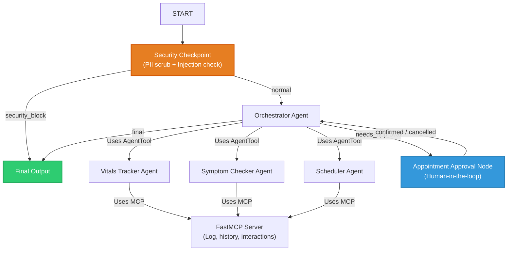

# HealthSync — Competition Submission Write-Up

## Problem Statement
Managing personal healthcare is often highly fragmented and overwhelming for patients. Patients must coordinate between tracking daily physiological metrics (like blood pressure and sugar levels), identifying medication risks, and scheduling appointments with different doctors. The lack of a centralized, secure coordinator causes patients to miss early warning signs or introduce harmful drug-drug interactions.

**HealthSync** solves this by providing a unified, secure agentic dashboard that integrates vitals tracking, symptom checking, drug interaction checks, and appointment scheduling in a privacy-compliant framework.

---

## Solution Architecture

The solution uses the ADK 2.0 Graph-based Workflow API. The user interaction query is filtered through a security node first, then routed to the `orchestrator` agent, which delegates tasks to specialized sub-agents via standard `AgentTool` transfer tools. It integrates a local Model Context Protocol (MCP) server for backing tools, and handles human approval before booking doctor visits.

---

## Concepts Used & File References

*   **ADK Workflow**: The orchestration graph is defined in [agent.py](file:///c:/Users/jithi/OneDrive/Desktop/jithin/adk-workspaceadk-workspace/healthsync/app/agent.py) using the new 2.0 functional API nodes (`START`, `final_output`, `security_checkpoint`, `appointment_approval`) and explicit routing edges.
*   **LlmAgent**: Three specialized agents (`vitals_agent`, `symptom_agent`, `scheduler_agent`) and one root coordinator (`orchestrator`) are defined as `Agent` models in [agent.py](file:///c:/Users/jithi/OneDrive/Desktop/jithin/adk-workspaceadk-workspace/healthsync/app/agent.py).
*   **AgentTool**: Used to register sub-agents as tools under the orchestrator (`vitals_tool`, `symptom_tool`, `scheduler_tool`) in [agent.py](file:///c:/Users/jithi/OneDrive/Desktop/jithin/adk-workspaceadk-workspace/healthsync/app/agent.py).
*   **MCP Server**: Implemented as a separate Python stdio process using the `FastMCP` framework in [mcp_server.py](file:///c:/Users/jithi/OneDrive/Desktop/jithin/adk-workspaceadk-workspace/healthsync/app/mcp_server.py).
*   **Security Checkpoint**: Implemented as the first graph node in [agent.py](file:///c:/Users/jithi/OneDrive/Desktop/jithin/adk-workspaceadk-workspace/healthsync/app/agent.py) to audit queries and filter/redact input before it reaches LLM agents.
*   **Agents CLI**: Scaffolded using `agents-cli scaffold create` and configured with pinned dependencies in [pyproject.toml](file:///c:/Users/jithi/OneDrive/Desktop/jithin/adk-workspaceadk-workspace/healthsync/pyproject.toml).

---

## Security Design
To handle medical questions safely, HealthSync implements several defensive measures:
1.  **PII Scrubbing**: The input query is evaluated using regular expressions to detect and redact critical identifiers like Social Security Numbers (`SSN`), Medical Record Numbers (`MRN`), and phone numbers.
2.  **Prompt Injection Filter**: Checks incoming text against known hacking prompts (e.g., "ignore previous instructions", "system prompt") to prevent malicious model overrides.
3.  **Structured JSON Audit Logs**: Writes structured entries containing event metadata, threat details, and classification levels (INFO, WARNING, CRITICAL) to log handlers for tracking compliance.
4.  **Consent Check Control**: Medical export queries (e.g., "share my health data") are blocked unless a consent flag is set in the session state, ensuring user-approved data distribution.

---

## MCP Server Design
The local Model Context Protocol server (Stdio connection) acts as the secure interface to the patient's data store and scheduling API. It exposes five distinct tools:
1.  `log_vital_sign`: Logs a physiological metric.
2.  `get_vitals_history`: Fetches past values for trend tracking.
3.  `schedule_appointment`: Commits a doctor appointment.
4.  `get_appointments`: Lists future doctor appointments.
5.  `check_drug_interactions`: Queries a drug-contraindication database to warn patients of dangerous drug pairings.

---

## Human-in-the-Loop (HITL) Flow
To prevent accidental bookings, doctor appointments require explicit confirmation:
*   When a scheduling request occurs, the scheduler sub-agent stores details in the state under `pending_appointment`.
*   The orchestrator callback transitions to `appointment_approval`.
*   The node triggers a `RequestInput` block, which suspends execution and displays a prompt: *"Please confirm: Do you want to schedule this appointment? Reply 'yes' or 'no'."*
*   The user must confirm manually to commit the change.

---

## Demo Walkthrough
*   **Vitals logging**: Typing *"Can you log my blood sugar as 110 mg/dL?"* triggers the vitals agent, which logs the entry and confirms the timestamp.
*   **Symptom/medication check**: Typing *"I'm taking Aspirin and Ibuprofen. Are there any interactions?"* triggers symptom agent checks, reporting bleeding risks with disclaimer logs.
*   **Appointment HITL booking**: Typing *"I need to schedule a checkup with Dr. Smith tomorrow at 10 AM"* prompts for confirmation, then books the slot upon user entry of `"yes"`.

---

## Impact / Value Statement
HealthSync reduces administrative load on patients, decreases transcription errors when tracking health metrics, warns users of dangerous drug-drug combinations, and manages schedules within a highly secure sandbox environment. It serves as a blueprint for privacy-preserving personal wellness coordination.
